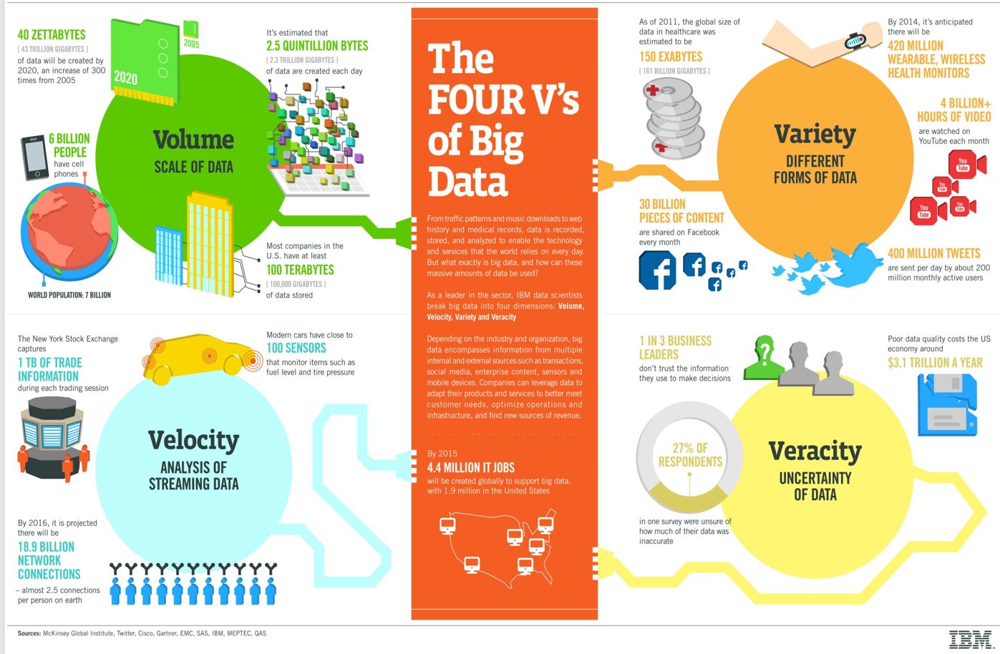
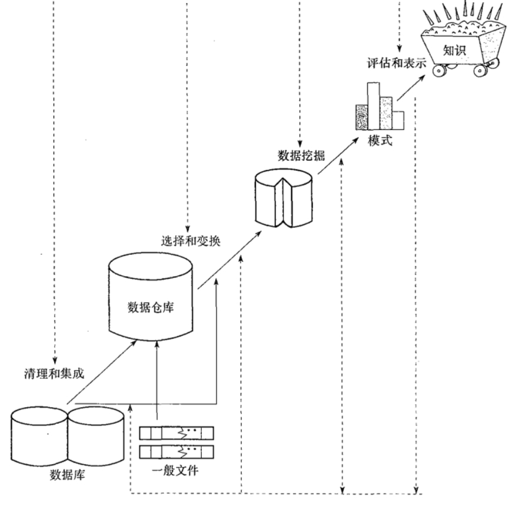

# Chapter-1-引言

## 一、大数据

1. 什么是大数据:Big data is a buzzword, or catch-phrase, used to describe a massive volume of both structured and unstructured data that is so large that it’s difficult to process using traditional database and software techniques.
	1. 大数据是一个流行语，用于**描述大量的结构化和非结构化数据**，这些数据是如此之大，以至于很难使用传统的数据库和软件技术进行处理。
	2. 无法在一定时间内用**常规软件**工具对其**抓取、管理、处理**的集合
2. 大数据的驱动因素
    1. 存储能力的提升
    2. 计算能力的提升
    3. 海量数据生成
        1. 传统各行各业数字化程度快速提升
        2. 新兴无线传感器和社交媒体的兴起
        3. 生成和使用数据的模式正在变化
            传统模式: 少量公司生成数据，其它人使用数据
            新型模式: 所有人都在生成数据,所有人都在使用数据
3. 大数据的特征（4个V）
    - 大容量、多样、真实性、速度（高速性）
    
    
    

## 二、 数据挖掘

1. 什么是数据挖掘
    
    从大量的数据中挖掘那些令人感兴趣的、有用的、隐含的、先前未知的和可能有用的模式或知识。
    
    并非所有数据分析都是“数据挖掘”：查询处理、专家系统……
    
2. 知识发现（KDD）过程
    1. 数据清理：消除噪声、删除不一致数据等
    2. 数据集成：多种数据源组和在一起
    3. 数据选择：从数据库中提取与分析任务相关的数据
    4. 数据变换：把数据变换和统一成适合挖掘的形式
    5. 数据挖掘：核心步骤，使用**智能方法提取数据模式（核心）**
    6. 模式评估：根据兴趣度度量，识别真正有趣的模式
    7. 知识表示：使用知识表示技术（可视化），向用户提供挖掘的知识
    
    
    
3. 数据挖掘四大任务
    1. **关联分析**（关联规则挖掘）
        
        发现数据之间的关联规则，这些规则展示属性/值频繁的在给定的数据中所一起出现的条件。
        
    2. **聚类分析**
        
        将类似的数据归类到一起
        
        最大化类内相似性，最小化类间相似性
        
    3. **分类/预测**
        
        找出描述和区分数据类/概念的模型，用以使模型能预测未知的对象类标签。（如决策树、人工神经网路）
        
    4. **孤立点/离群点分析**
        
        与数据一般行为或模型不一致的鼓励数据
        
4. 数据挖掘与其他学科的关系
    
    与数据库系统、统计学、物理学、机器学习、信息检索等学科有密切联系
    
    
    

*Else*

