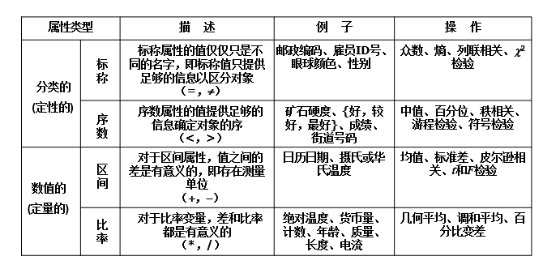
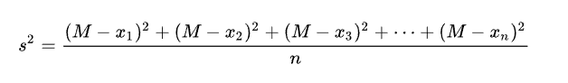
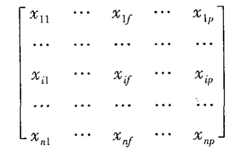
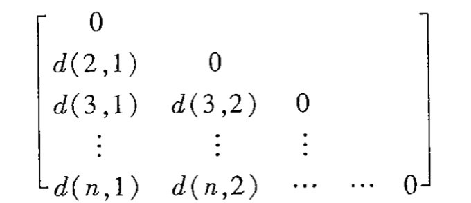

# Chapter-2-认识数据和数据预处理

## 一、认识数据

### 1. 基本概念

1. **数据** 对描述对象的抽象
2. **数据对象** 记录、点、向量、模式、事件、样本、案例、观测或实体
3. **数据集** 数据对象的集合
4. **属性** 刻画对象的基本性质和特性（变量、特性、字段、特征、维）
5. **属性值** 赋予属性的数或符号

### 2.数据的属性

- 分类型和数值型
    - 分类型
        - 标称型：目标变量的结果只在**有限目标集中取值,仅用于分类**，意味着与命名相关**，没有任何内在顺序或等级的数据类型，**且在处理时需要编码。
        - 序数型：具有内在顺序或等级的数据类型，可以进行更复杂的分析（相关性分析，回归分析等）
    - 数值型
        
        目标变量可以从**无限的数值集合中取值**
        
        (chatgpt:区间型和比率型的区别在于零点的含义)
        

- 离散型（整型/字符串数据）和连续性（浮点型，属性为实数：温度、高度、重量…）
- 二元属性、对称型（性别）和非对称型（化验结果）

*Else（大概率不靠）*

数据类型:记录数据、图数据、有序数据…（见ppt）

### 3. 数据的统计描述

#### 3.1 中心趋势

> 描述中部或中心位置，给定一个数据，其值大部分落在何处

1. **中位数**
   
    *~~大数据：近似值估计（线性插值方法）~~*
    
2. **均值**
    
    均值、加权平均、中列数（数据集最大值和最小值的平均值）
    
3. **众数**
    
    多个众数：
    
    对于非对称的单峰数据,有以下经验关系：
    
    `mean-mode ~ 3 * (mean-median)`即为 `均值 - 众数 近似等于 3*(均值 - 中间数)`
    

#### 3.2 散度

> 描述数据如何分散

1. **方差/标准差**
    1. 方差公式：
        
        
        
    2. 标准差公式：
        
        
        
2. **分位数**
    
    *将数据划分为大小相等的连贯集*
    
    1. 百分位数——把数据分为大小相等的连贯集
    2. 四分位数、四分位极差（表示被数据的中间一般所覆盖的范围：Q3-Q1）
3. **极差** max-min
4. Else:五数概括（min、Q1、medium、Q2、max）、盒图
    
    
    

#### *3.3 可视化*

> *数据的图形显示*
> 

*分位数图、直方图、散点图.0*

### 4. 数据的相似性/相异性度量

- 数据矩阵（n个对象，p个属性）与相异性矩阵（两个对象之间）

#### 4.1 标称型属性

p：属性总数，m：状态取值匹配的属性数目

#### 4.2 二元变量属性

列联表——q（相等的属性数）…

1. 对称型
    
    
    
2. 非对成型
    
    
    

#### *~~4.3 序数型变量数据~~*

~~*将数据离散化并映射到[0,1]上，而后使用距离公式运算相异性*~~

#### 4.4 数值属性数据

> 使用距离进行度量

1. 闵可夫斯基（Minkowski）距离（p-范数）
    
    
    
    其中 i = (xi1, xi2, …, xip)和 j = (xj1, xj2, …, xjp) 是两个 p-维数据对象(q 正整数)
    
2. 曼哈顿 (Manhattan)距离(q=1)

	

1. 欧几里得(Euclidean)距离（q=2）
    
    
    
2. 加权距离（例：加权欧几里得）
    
    
    

#### 4.5 其他度量方式

1. **余弦距离**

	

1. 相关系数（皮尔逊系数）
    
    R（A，B）=ax+b → **a>0 R=1** |  **a<0 R=-1**
    
    
    
2. 马氏距离
    
    孤立点/离群点靠距离的影响，计算距离时同时考虑其分布，在主要方向上计算相似性时距离更小，非主要方向上距离更大
    
3. KL散度
    
    关注于两个分布之间的相似性/相异性
    
    传统比较方法：均值比较、方差比较…
    
    KL散度：从信息熵/概率计算
    
    
    

~~Else:度量学习（针对高维诅咒问题，将高维映射到低维表征）~~

## 二、数据预处理

- 数据质量——准确性（噪声）、完整性（缺少属性值）、一致性(编码或命名上的差异)、时效性、可信性、可解释性
- 没有高质量的数据，就没有高质量的挖掘
- 数据预处理的主要任务：
    - 数据清理（空缺值、噪声、孤立点…）
    - 数据集成（集成多个数据库、文件，**数据的一致性**）
    - 数据规约（高维/大数据时，得到数据集的压缩表示，得到相同或相近的结果）
    - 数据变换（规范化、聚集）
    - **数据离散化（连续数据进行离散处理）**

### 1 数据清理

#### 1.1 缺失值处理

1. 忽略对象
2. 人工填写
3. 全局变量填充（unknow、-∞…）
4. 平均值代替

1. 属性的平均值
2. 给定对象同一类（剩余属性较相近）的属性的平均值

1. 预测最可能的值（贝叶斯公式、判定树…）

#### 1.2 噪声处理

1. 分箱
    
    排序→分到等深的箱中→按箱的值进行均值平滑/中值平滑/边界平滑…
    
    例：4，8，15→9，9，9(均值平滑)→4，4，15（边界平滑）
    
2. 聚类
    
    检测并去除孤立点
    
3. 回归
4. 3σ原则

### 2. 数据集成

- 数据集成：数据整合到一个存储体内
- 模式集成：整合元数据、**面临实体识别问题（不同数据源的实体一样，但是名称不一样）**
- 冗余数据处理：相关分析检测（皮尔逊系数）

#### 2.1 数值型

- 相关系数（与数据相似性检验中的同理）
- 协方差

#### 2.2 标称型

- 卡方检验 χ2（假设A和B是独立的，卡方特别大则拒绝该假设）
    
    
    
    
    

### 3. 数据归约

#### 3.1 维度规约

1. 小波分析（主要用于图像分析中，滤波后使用低频信号）
2. PCA（K-L变换）
    
    映射到一个新的投影上，其能表示数据的最大变化
    
    信息丢失最小化，方差最大化作为主要方向
    
    可解释性差。
    
    
    
3. 特征筛选
    
    删除不想关的属性
    
    挑战：枚举所有解，找最有用的几乎不可能
    
    策略：启发式（逐步向前选择、逐步向后删除）
    
    算法：信息增益、互信息、卡方分布
    

!!!💡 信息熵
刻画系统的混乱程度
定义：

Example：

!!!💡 条件信息熵
在X的基础上看Y是否是混乱的，熵越小，Y越稳定，X更重要

Example

!!!💡 信息增益
比较使用了X和不使用X的熵，增益越大，特征越重要

#### 3.2 数量规约

现实不压缩

选择替代的、较小的数据表现形式来减少数据量(感觉不太重要)

- 回归、聚类、采样

### 4 数据变化

#### 4.1 规范化

1. 最小最大规范化（可以归一化到0-1之间）
    
    
    
2. z-score规范化

	

### 5 数据离散化

1. 离散化（连续数据）——划分区间
2. 概念分层（标称数据）——高层概念（中老年）代替底层属性值（年龄）
3. 分箱、直方图、聚类、信息熵…