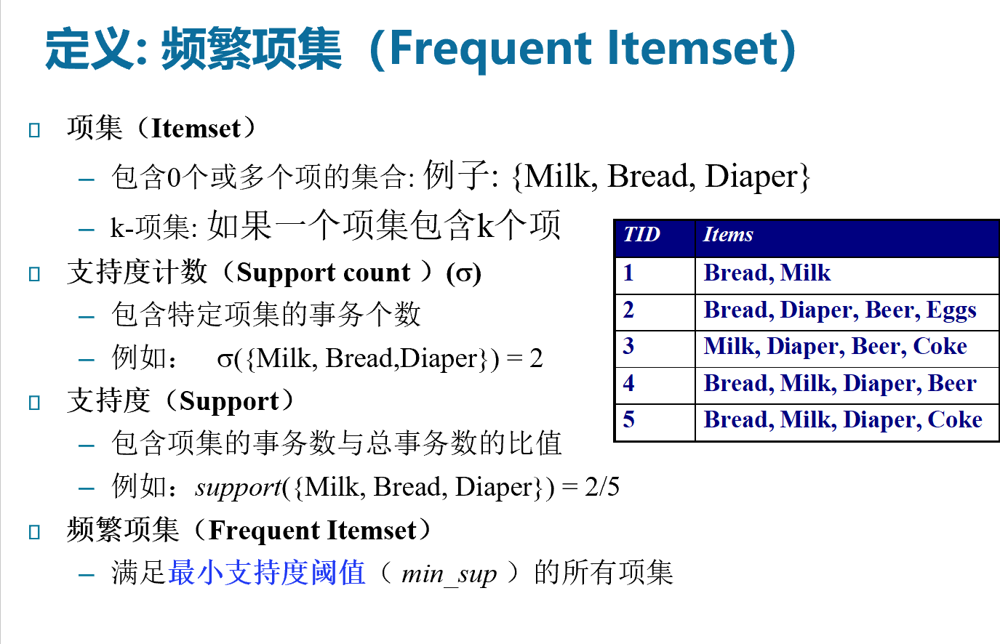

# Chapter-3-关联规则挖掘
## 一、概念

1. 目的：在事务、关系数据库中的项集和对象中发现**频繁模式、关联规则、相关性**或**因果架构**
    
    *频繁模式：数据库中频繁出现的项集*
    
    关联规则：X → Y[support, confidence]
    
2.  支持度、置信度
    
    *支持度：某个项集（A、B同时）出现的比例，*P(A∪B)
    
    *置信度：A项出现时，B项出现的比例* P(B|A)=P(A∪B)/P(A)
    

	

	

1. 关联规则挖掘的步骤：频繁项集产生→规则产生
	- *Brute-force*
    
		
    
1. 降低产生频繁项集复杂度的方法
    1. 减少候选集的数量——Apriori
    2. 减少比较的次数（压缩…）

## 二、Apriori算法

### 1. Apriori基础概念

1. 范式：生成→测试
    
    k项集→(连接、剪枝)→生成k+1候选项集→根据实际DB进行测试
    
2. 性质
    
    性质一：如果一个项集是频繁的，那么其所有子集一定频繁
    
    性质二：如果一个项集是非频繁的，则其所有超集一定是非频繁的
    
3. 剪枝原理
    
    基于支持度的剪枝：一个项集的支持度不会大于其子集的支持度，即支持度度量的反单调性。
    
    
    

### 2. Apriori算法流程

### 3. Apriori改进策略

#### 3.1 计算复杂性

1. 支持度阈值→阈值越低，频繁项集越多、长度越长，计算越复杂
2. 项数
3. 事务数→扫描数据库的事务数

#### 3.2 改进策略

1. 减少事务数据库的扫描次数
2. 压缩候选数量
3. 便于候选计数

#### 3.3 具体方案

1. Hash-based itemset counting（散列项集计数)
    
    一个其hash桶计数小于阈值的k项集不可能是频繁的
    

	

	

1. Transaction reduction（事务压缩）
    
    删除不可能对寻找频繁项集有用的事务
    
2. Partitioning（划分）
    
    找出局部频繁→得出全局频繁
    
    
    
3. Sampling（采样/抽样）
    
    选取数据库中的一个样本，牺牲精度换取有效性。
    
    扫描一次数据库，验证样本中的频繁模式。
    
    再次扫描数据库，找出遗漏的频繁模式（可选）。
    

## 三、*FP增长算法（Frequent-Pattern Growth）（理解）*

### 1. 概念

- 基本思想：将数据组织为紧凑的数据结构，直接从该结果中提取频繁项
- 范式：生成FP树并直接寻找频繁项

### 2.流程

 条件模式基→条件FP树→挖取频繁项集 （单路径）

### 3. 优缺点

- 优点：效率比Apriori高
- 缺点：内存需求大，算法实现复杂

## 四、关联规则的评估（理解）

1. 根据统计论据建立
    
    涉及相互独立的项或覆盖少量事务的模式被认为是不令人感兴趣的，因为它们可能反映数据中的伪联系。
    
2. 根据主观论据建立
    
    挖掘“有趣”的规则，强规则不一定是有趣的，甚至是误导的
    

这里的支持度为后件的支持度