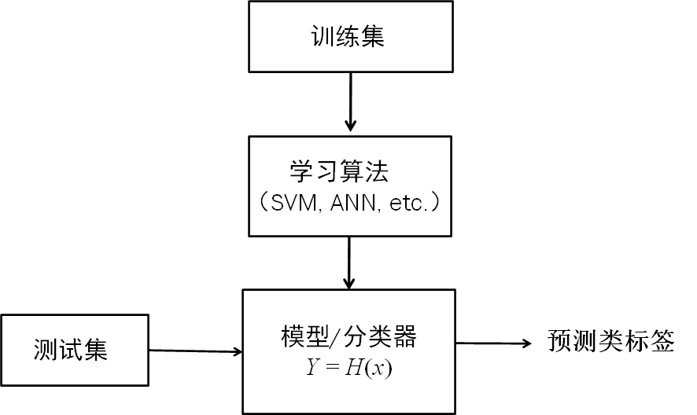

# Chapter-4-分类

## 一、基本概念

1. 监督学习和无监督学习
    
    **无监督学习**：数据集中的对象的类标记是未知的，目的是挖掘潜在的数据内部模式（关联规则挖掘、聚类分析）
    
    **有监督学习**：数据集中对象的类标记已知，通过类标记的指导下学习数据中的模式，利用模式对新数据进行预测。
    
    
    
    这是有监督学习
    
2. 生成模型和判别模型  
    
    **生成模型：**
    
    - 希望从数据中学习/还原出原始的真实数据生成模型
    - 常见方法为学习数据的概率分布
    - 朴素贝叶斯方法、隐马尔可夫模型
    - 容量大时，更接近生成模型；能处理隐含变量的情景
    
    **判别模型**：
    
    - 从数据中学习不同类概念的区别从而进行分类
    - KNN、SVM、Decision Tree，etc.
    - 速度快、准确率较高
    
    [机器学习中的判别式模型和生成式模型](https://zhuanlan.zhihu.com/p/74586507)
    
3. 分类问题和回归/预测问题
    
    **分类问题：**数据的分析任务是分类，根据训练集和类标号构建模型
    
    **预测问题**：预测连续值和趋势，建立连续函数值模型，预测未来的情况比如预测空缺值
    

## 二、分类

### 1. Decision Tree

#### 基本构造

1. 每个**内部节点**表示一个**属性上的测试**
2. 每个**分支**代表该**测试的输出**
3. 每个**树叶节点**代表**类或类分布**

#### 算法流程

**基本思想：**贪心算法：自顶向下的分支方式构造决策树（非回溯）

**三大步骤：**特征选择→决策树生成→剪枝

- 特征选择
    - 属性选择度量：根据某种启发信息或统计信息进行选择（如：信息增益）,使得分裂子集中待分类项尽可能属于同一类（纯！）
    - 信息增益(ID3)
        - 选择具有最高信息增益（即最大熵压缩）的属性作为测试属性
        - 计算方式：
            
            
            
        - Example:
            
            
            
        - 缺点：容易过拟合，即每个划分子集只有一个样本，info(D)=0
    - 信息增益率：C4.5
        - 规范化信息增益
        - 计算方式：
        
        
        
    - 基尼指数：Cart（输出结果必须为二叉树）
        - 度量数据元组的不纯度。
        - 计算方式：
        
        
        
- 决策树生成
    
    
    

#### 算法优缺点

- 优点
    1. 不需要领域知识和参数设置，适合于探测式知识发现
    2. 利于处理高维数据
    3. 可解释性强
    4. 准确度高
- 缺点
    1. 容易过拟合
    2. 忽略了属性间的相关性

#### 过拟合问题

- 定义：为了得到一致假设而使假设变得过度复杂称为过拟合
- 过拟合是监督学习中普遍存在的一个问题
    - 原因：因为训练样本真实情况下的**只是一个抽样集**，数据（测试集和训练集）分布不一致（数据太少，模型太复杂）
    - 结果：**泛化能力不强**
- 解决策略
    - 增加样本集
    - 降低模型复杂度
    - 噪声去除
    - Train-Validation-Test【训练（确定模型内部参数）-验证（进行模型的选择）-测试（只使用一次，用于验证最终模型）】
    - 正则项（Regularization），通过设置惩罚项进行限制（如选择VC维）

#### 树剪枝

- 决策树中造成过拟合的原因
    - 分枝太多，某些反映训练数据中的异常，噪音/孤立点
    - 对未参与训练的样本的低精度预测
- 如何限制
    - 降低层高
    - 增加叶子节点包含样本最小数（小于该数就停止继续划分）
    - 树剪枝
        - 先剪枝：提前终止树构造（如果对一个节点的分裂会产生低于给定的阈值的度量，划分停止，阈值选择困难）
        - 后剪枝：从完全生长的树中剪枝（代价高，对于小样本而言优于先剪枝）

### 2. KNN

#### 流程

1. 找距离
2. 找邻居（最近的k个）
3. 做测试
#### 优缺点

- 优点
    - 简单有效、不需要训练
    - 在线、多分类/多标签（稀有事件分类）
- 缺点
    - 懒惰学习：对测试样本分类时计算量大，内存开销大，评分满
    - 类不平衡：当样本不平衡时，如一个类的样本容量很大，而其他类样本容量很小时，有 可能导致输入一个新样本时，该样本的K个邻居中大容量类的样本占多数；
    - 可解释性差
    - K敏感：K值小分类精度下降，K值大分类效果降低
- 其他问题
    - 类别的判定方式（距离更近的邻居也许更应该决定最终分类）
    - 距离度量方式（高维诅咒问题）

### 3. 朴素贝叶斯（Naïve Bayes）

- 最终概率和分子呈正相关
- 优缺点
    - 优点：输出概率，对文本分类效果较好
    - 缺点：类条件独立假设（强假设，不符合则降低准确率）

### 4. SVM

- 基本思想：间隔最大化
- 分界上的点称为支持向量
- 优点
    - 支持小样本学习（支持向量）
    - 能解决非线性问题（kernel、核技巧）（映射）
    
    
    
    - 泛化能力强（结构风险最小化）
        - 泛化能力：对未知数据表现良好的能力

### 5. 人工神经网络

- 理论化的人脑神经网络数学模型，多输入单输出的非线性阈值器件
- 输入层、隐藏层、输出层

- 反向传播（通过学习规则，自动调节神经元之间的连接强度或拓扑结构）

- 作用函数、激活函数、传递函数

#### 5.1 感知机模型

- 输入、输出用二进制表示。
- 基本感知机是一个二层网络，只能解决线性问题
- 非线性问题需要用到多层感知机（MLP）

#### 5.2 BP网络

连续不断地在相对于误差函数斜率下降的方向上计算网络权值和偏差的变化而逐渐逼近目标的。

- 两部分：正向传播、误差的反向传播

- 人工神经网络优缺点
    - 优点：拟合能力强、
- 缺点
    - 过拟合、训练慢

## 三、分类评估指标

1. 分类准确
    
    
    
2. 非平衡类

	

	

## 四、集成学习

- 准则
    - 基学习器足够好
    - 基学习器多样化（核心）
- Bagging
    
    
    
    - 过程

	    
    
	    取出后需要放回，使得下次采样仍有可能被选中
    
- 随机森林 (Random Forset，RF)
        - 引入随机属性选择→(随机选取k个子集，而后在其中选取最优划分)
- Boosting
    - 将弱学习器提升为强学习器
    
	    
    
    - adaboost
        
        
        
    - lightGBM
        
        
        
- Stacking
    - 先生成一个初学习器，使用它再生成数据用于训练次学习器
    
    