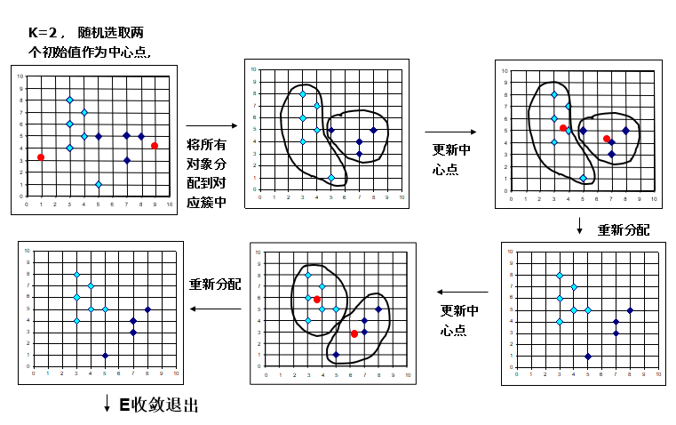

# Chapter-5-聚类

## 1. 什么是聚类

- 聚类就是将数据分为多个簇，使得在同一个簇内对象之间具有较高的相似度，不同簇之间的对象差别较大

## 2. 聚类的功能

- 获得数据内部结构的有效方法
- 作为其他算法的预处理步骤
- 完成噪声点/离群点挖掘

## 3. 聚类的分类

> 从不同的角度出发

### 3.1 基于划分的方法

- 给定n个，划分为k个，每个划分就代表一个簇
- 先进行初步划分，而后反复迭代改进之前的划分

#### K-Means

- 优点：简单、快捷
- 缺点：
    - 对k敏感
    - 对初始中心点敏感
    - 无法发现非高斯簇（非球状或差别很大的簇）
    - 对离群点敏感

### 3.2 基于层次的方法

- 层次凝聚：自底向上 AGNES
- 层次分裂：自顶向下 DIANA

### 3.3 基于密度的方法

- 只要一个区域中的点的密度大于某个阈值，就把它加到与之相近的聚类中去。
- 这类算法**能克服基于距离的算法只能发现“类圆形”的聚类的缺点**，可发现任意形状的聚类，**且对噪声数据不敏感**

#### DBSCAN

- 利用高密度连通性，快速发现任意形状的类
    - 高密度总是被低密度所分割
    - 能从由噪音的空间数据中发现任意形状的聚类
- 基本思想
    - 对于一个类的每个对象，在其给定半径的领域中包含的对象不能少于”密度“
- 术语定义
    - 核心点、边界点、噪声点
    
    
    
    
    
    
    
- 流程

- 优缺点
    - 优点：
        - 发现任一形状的簇
        - 可以检测噪声
        - 无需设置k
    - 缺点：
        - 很难设置参数，对两个参数敏感

### 3.4 基于网格的方法

将对象空间量化为有限数目的单元，形成一个网格结构，所有的聚类都在这个网格结构中上进行。

## 4.离群点检测

### 4.1 什么是离群点

- 离群点是一个数据对象，它显著不同于其它数据对象，好像它是被不同的机制产生的一样。

### 4.2 离群点分类

- 全局离群点
    
    和别的点没有任何关系
    
- 局部离群点
    
    对全局而言不是离群点，对于某个簇是离群点
    
- 集体离群点
    
    某一个集体和其他不同
    

### 4.3 检测方法

#### 4.3.1 基于统计

基本思想：对给定的数据集合假设了一个分布或概率模型(例如, 正态分布), 然后根据模型采用不一致性检验(discordancy test)来确定孤立点

#### 4.3.2 基于距离

基本思想：基于距离的孤立点: DB (p, d)-孤立点是数据集T 中的一个对象o, 使得 T 中的对象至少有p 部分与o 的距离大于d。

- 基于索引
- 嵌套循环
- 基于单元

#### 4.3.3 基于偏差

基本思想：通过检查一组对象的主要特征来确定孤立点 ，如果与给出的描述偏离大的对象被认为是孤立点 。

#### 4.3.4 基于密度

对象p的局部异常因子表示p的异常程度，局部异常因子愈大，就认为它更可能异常；反之则可能性小。

簇内靠近核心点的对象的LOF接近于1，那么不应该被认为是局部异常。而处于簇的边缘或是簇的外面的对象的LOF相对较大，如前面图中对象o1， o2。

