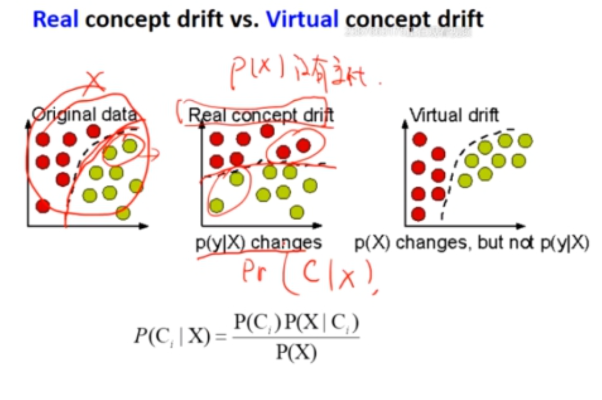

# Chapter-6-大数据挖掘

## 1. 哈希技术

- 大数据面临的问题
    - 高维诅咒问题
    - 存储问题
    - 检索速度问题
    - `example:最近点检索`
        
        `给定一个检索点，如何在数据库中找出最邻近的点呢？`
        
- 哈希技术的作用

### 1.1 最小哈希（可选、近邻）

1. 定义：首次出现1的行号
2. 计算签名矩阵

## 2. 数据流挖掘

1. 什么是：在连续的、不断变化的数据流中发现有用信息的过程。
2. 数据流挖掘的挑战
    1. 访问一次（单程处理）
    2. 时间低
    3. 空间低
    4. 概念偏移
        
        数据流中概念或模式随时间的推移而发生变化的现象。
        
        
        
3. 概念偏移的检测
    1. 基于分布
        - 对相同时间间隔（窗口）检测P(C|X)，如果检测到变化就说明发生了
        - ADWIM：处理当前数据，发生显著性变化就用新的代替老的
        - 窗口大小不好控制、学习偏移慢、虚假的概念偏移
    2. 基于错误率
        - 错误率突然变大，说明有概念偏移
        - 对噪声敏感，对缓慢变化的数据难以处理，取决于模型的健壮性
4. 数据流分类
    - 快速决策树（VFDT）
5. 数据流聚类
    1. 线上把数据用合适的数据结构处理，线下用传统方式去进行聚类
    2. 簇特征
    
    
    

## 3. Hadoop/Spark

### 3.1 什么是Hadoop

1. 什么是Hadoop
    
    软件框架，用于，用于跨大型计算机集群对大型数据集进行分布式处理 TB PB 级别.
    
2. Hadoop设计理念
    1. 并行化营参
    2. 容错及一
    3. Map Reduce
3. Hadoop生态
4. HDFS
    1. NameNode 元数据
    2. DataNode 实际数据
    
    
    
5. Map Reduce
    1. 擅长一轮计算
    2. 没有很好的共享机制

### 3.2 Spark

1. 什么是Spark
    
    
    
2. RDD（弹性式分布式数据集）
    
    
    
3. 擅长多轮
4. API

