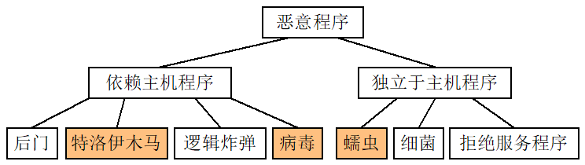

# 第一章 病毒基本介绍
## 计算机病毒的定义

1. 狭义定义
    
    > 《中华人民共和国计算机信息系统安全保护条例》中，计算机病毒被定义为：“计算机病毒是指编制或者在计算机程序中插入的破坏计算机功能或者破坏数据，影响计算机使用并且能够自我复制的一组计算机指令或者程序代码
    
2. 广义定义
    
    > 计算机病毒(Computer Virus)，是一种人为制造的、能够进行自我复制的、具有对计算机资源进行破坏作用的一组程序或指令集合
    > 
    - 主动传染：文件型病毒、网络蠕虫等
    - 被动传染：用户拷贝了寄生着病毒的文件

## 计算机病毒的特征

1. 可执行性（程序性）→可防治性、可清除性
    1. 人为特制→病毒各式各样
    2. 反病毒技术：提前获得控制权，识别并清楚
2. 传染性
    1. 是否具有传染性，是判别一个程序是否为计算机病毒的首要条件。
        
        文件型病毒：是否感染了一定数量的文件
        
        网络蠕虫：是否对多个目标发起攻击
        
    2. 指病毒具有把自身复制到其他程序的能力。
3. 非授权性
4. 隐蔽性
    1. 传染的隐蔽性
    2. 存在的隐蔽性（不破坏系统的正常功能）
5. 潜伏性
    1. 是否潜伏取决于病毒的目的，是破坏计算机、偷窃数据，还是联合其他被感染的计算机实施复杂的联合攻击。
    2. 潜伏性愈好，其在系统中的存在时间就会愈长，病毒的传染范围就会愈大
6. 可触发性
    1. 可触发性与潜伏性是配对的，潜伏后必须要能被触发，否则就失去了杀伤力。
    2. 计算机病毒因某个事件或数值的出现，诱使病毒实施感染或进行攻击的特性
7. 破坏性
8. 主动性
9. 针对性：特殊软硬件环境
10. 衍生性：旧病毒给新病毒提供技术支持
11. 寄生性：依赖于宿主程序的执行
12. 不可预见性：没有反病毒工具可以预见并防御所有病毒
13. 诱惑欺骗性：我来发福利了，欸嘿，发的是病毒
14. 持久性：很难恢复，破坏不可逆

## 病毒的本质

人为制造的，可以自我复制的计算机程序

## 病毒的分类

### 破坏能力、破坏情况

- 破坏能力：无害、无危险、危险、非常危险
- 破坏情况：良性（无害无危险）、恶性（危险、非常危险）

### 攻击的操作系统

Linux、Windows、Dos、Unix、Android…

### 攻击的机型

微型（巴基斯坦病毒）、工作站、小型计算机、中大型计算机

### 特有的算法

- 伴随型病毒
病毒并不改变文件本身，它们根据算法产生文件的伴随体。
- “蠕虫”型病毒
蠕虫通过计算机网络传播，不改变文件和资料信息，除了内存，一般不占用其它资源
- 寄生型病毒
除了伴随型和“蠕虫”型，其它病毒均可称为寄生型病毒，依附在系统的引导扇区或文件中
- 练习型病毒
病毒自身包含错误，不能进行很好的传播，例如一些在调试阶段的病毒
- 变形病毒(又称幽灵病毒)
一般由一段混有无关指令的解码算法和被变化过的病毒体组成

### 链接方式

源码型（高级语言编译得到）、嵌入型（CIH）、外壳型（Shell，在程序的首尾）、译码型（解释执行）、操作系统型

### 传播介质

单机、网络

### 寄生对象和驻留方式

- 寄生对象：引导、文件、混合
- 是否驻留内存：驻留——中断向量，系统所有程序执行都会执行病毒

## 恶意程序、蠕虫、木马

- 恶意程序：未经授权便干扰或破坏计算系统/网络的程序或代码
    - 依赖于主机程序的恶意程序
    - 独立于主机程序的恶意程序
    
    
    
- 蠕虫
    - 一种独立的可执行程序，主要由主程序和引导程序两部分组成
        - 主程序：用于干正事
        - 引导程序：把蠕虫带入计算机
    - 蠕虫程序的工作流程可以分为漏洞扫描、攻击（获取权限）、传染（发送蠕虫本体）、现场处理（隐藏、信息收集等）四个阶段
        
        
        
    - 特性：方式多、传播速度快、难以清理、破坏性强
- 木马（特洛伊木马）
    - 表面上是有用的，实际上是有毒的
    - 客户端、服务端

## 命名规则

- 通用的：发作时间、症状、传染方式、自身宣布的、发现地、字节长度
- 容易重名、相同病毒有不同名字
- 国际惯例：前缀+病毒名+后缀
    - 前缀：发作的操作系统或类型
    - 后缀：区分病毒家族各病毒的不同（类似于版本号？）
    - 例如：WM.Cap.A
    A表示在Cap病毒家族中的一个变种，WM表示该病毒是一个Word宏(Macro)病毒
    - 优先级：病毒的发现者(或制造者)→病毒的发作症状→病毒的发源地→病毒代码中的特征字符串
- 由于存在 “灵活”的命名规则和惯例，再加上杀毒软件开发商各自的命名体系存在差异、计算机病毒研究学者/反病毒人员在为病毒命名时的个人观点、所依据的方法也各不相同，最终造成同种病毒出现不同名称的混乱现象
- 病毒命名可以做出更细致的规定，如：
[病毒前缀]+[主要变量]+[次要变量]+[病毒名]+[病毒后缀]
比如一个病毒名为：DosVirus.com.BOOT.kot.B，那么可以解释为：这是一个DOS病毒，[仅仅感染.COM](http://xn--rmqa802lekg.com/)，感染引导区，病毒名为kot，版本号为B。

## 危害

蓄意破坏、偶然性破坏、附带性破坏、心理和社会危害

## 症状

## 传播途径

不可移动、移动设备、有线网络、无线网络

## 生命周期

开发→传染→潜伏（静态、动态）→发作期→发现→消化→消亡

## 渊源

游戏、软件加密、坏人、研究但被泄露、APT（政治、军事等目的）

## 防治

主动预防、被动处理

## 研究原则

自尊自爱自律自强

