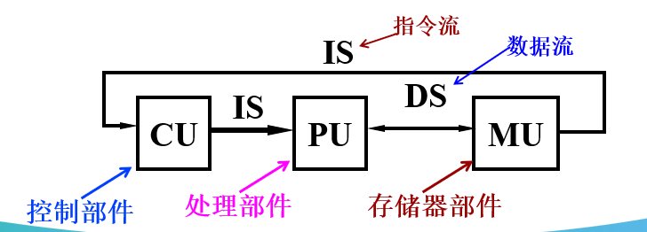

# C1 量化设计与分析基础
## 1 计算机分类

### 1.1 Flynn’s 分类

- SISD
    - 任一时钟周期，只有一个指令流在cpu执行，只有一个数据流作为输入。
    - 确定执行：程序在给定的输入条件下多次运行，执行流程和结果是一致的。
    - 对SISD模型改良，采用指令级并行技术：流水线、超标量、推测执行等
    - 串行计算机采用的结构
        
        
        
- SIMD
    - 一种并行计算机：数据级并行
    - 任一时钟周期，所有处理单元执行相同指令，每个处理单元能对不同数据元素进行操作。
    - 同步和确定性执行
    - 适用于处理高度规整操作的问题，如图像处理
    - 类型
        - 处理器阵列（Processor Arrays）
        - 向量流水线（Vector Pipelines）
        - 标准指令集的多媒体扩展，1996始于Intel   Pentium MMX
        - GPU

    

    

- MISD
    - 任一时钟周期，单个数据流进入多个处理单元，每个处理单元用单个指令流对数据进行独立操作。
    - 很少用，可能的应用：
        - 多频滤波器对单信号流进行操作
        - 多重加密算法对单个编码信息进行加密
    
    
    
    
    
- MIMD
    - 线程级或任务级并行。
    - 每个处理器可以执行不同的指令流，可以对不同数据流进行操作
    - 各处理器执行可以是同步的或异步的，确定性的或非确定性的
    - 比SIMD更灵活，适应性更强。很适合任务级并行；也可以开发数据级并行，开销比SIMD高。
    - 多核芯片、多处理器构成的处理器
    
    
    

- Flynn分类模型是抽象和粗略的：
    - 现代的不少并行处理器是SISD、SIMD和MIMD的**混合类型**。
    - 例如：IBM有一款多核芯片的Cell中，包括8个SIMD的处理单元和1个SISD的Power处理器。
    整体看，Cell是一个MIMD处理器。

### 1.2 市场分类

- **个人移动设备**
- **桌面计算机**
    - 性能评估：基准测试程序
    - 个人计算机
        
        个人计算机主要为一个用户提供良好的计算性能和较低成本的工作环境。最早出现的个人计算机是1977年Apple公司的Apple II 微型计算机。
        
    - 工作站
        
        工作站是指具有完整人机交互界面、**图形处理性能**和较高计算性能，可配置大容量的内存和硬盘，I/O和网络功能完善，使用**多任务多用户操作系统**的小型通用个人化计算机系统。1983年美国Apollo公司推出了首台适合计算机辅助设计（CAD）的工作站。
        
- **服务器**
    - 特性
        - 可靠性（Dependability）
            
            采用容错技术，如ECC（Error Checking and Correcting）内存、RAID（Redundant Array of Independent Disks）技术、热插拔技术、冗余电源、冗余风扇、机箱锁、口令保护等。
            
        - 可扩展性（Scalability）
            
            计算能力、存储系统、I／O带宽等。
            
        - 吞吐量（efficient throughput）
            
            服务器要将其数据和硬件提供给网络用户共享，其主要设计目标就是为了达到高效的吞吐量。的整体性能——以每分钟处理的事务数或每秒所提供的页面数来衡量。
            
    - 规模分类：大中小、入门
    - 外形与结构：塔式（入门型）、机柜式（中大型）
    - 通用开放：通用开放系统（采用**IA32架构服务器**。性价比高）、非开放（RISC处理器的服务器，操作系统一般基于Unix、结构封闭、高可靠性、高速）

- **集群/仓库级计算机**
    - 一组桌面机或服务器通过局域网连接，运行时像一个大型计算机系统。
    - 关键问题：性价比、吞吐量、可靠性
    - 特殊问题：配电，制冷
  
- **嵌入式计算机**
    - 硬件部分：嵌入式微处理器、存储器、I/O接口、外设部件等；
    - 软件部分：操作系统软件 ( 要求实时和多任务操作 ) 、应用软件。
        - 实时性能 (soft & hard)
        - 严格的资源限制：有限的的存储空间, 低功耗消费,...
        - 处理器核心与特定应用电路在一起使用（DSP、Digital TV）
    - **嵌入式与非嵌入式的区别：能否运行第三方软件。**

## 2. 计算机系统结构定义和设计任务

### 2.1 原始概念

程序员（机器语言）看见的（计算机）系统属性，即慨念性结构和功能行为，以区分数据流动和控制逻辑设计的组成及物理实现。

- 计算机系统结构：机器语言程序员看到的创痛及其级所具有的主要属性——ISA
- 计算机组成：计算机系统结构的逻辑实现（五大功能不见组成以及逻辑设计）
- 计算机实现：计算机组成的物理实现，器件技术占主导作用
- 例：
    
    ① 主存容量与编址方式(按位、按字节、按字访问等)的确定属于**计算机系统结构**。 
    
    ② 为达到所定性能价格比，主存速度应多快，在逻辑结构上需采用什么措施(如多体交叉存储等)属于**计算机组成**
    
    ③ 主存系统的物理实现，如存储器器件的选定、逻辑电路的设计、微组装技术的选定属于**计算机实现**。
    
- 计算机系统结构、组成和实现三者的相互影响
    - **具有相同计算机系统结构(指令系统相同)的计算机，因为速度要求不同等因素可以采用不同的计算机组成。**如，取指令、译码、取操作数、运算、存结果可以在时间上按顺序方式进行，也可以让它们在时间上按流水线重叠方式进行以提高执行速度。
    - **一种计算机组成可以采用多种不同的计算机实现**。例如，主存器件可以采用SRAM芯片，也可以采用DRAM芯片。

### 2.2系列机

**相同的系统结构，具有不同组成和实现的一系列不同型号的计算机。**

- 软件兼容性：同一个软件可以不加修改地运行于系统结构相同的各档机器上，而且运行结果一样，差别只是运行时间不同。
    - 向后兼容：在某一时间生产的机器上运行的目标软件能够直接运行于更晚生产的机器上。
    - 向上兼容：在低档机器上运行的目标软件能够直接运行于高档机器上。
- 缺点：要求体系结构基本不改变，这无疑又妨碍了计算机体系结构的发展。

### 2.3 ISA

**硬件与软件之间的接口**

- 角色
    - 开发者与硬件之间的接口
    - 两代芯片之间的合同
- 好的接口
    - 多种实现
    - 用于不同方面
    - 为更高层提供功能方便
    - 允许更低层能有效实现
- 7个重要特征
    - ISA的类型：现代通用寄存器结构，早期累加器结构
    - 存储器访问：如，按字节访问
    - 寻址方式
    - 操作数类型和大小：8位字符，32位整型数
    - 操作类型：数据传输，算术/逻辑
    - 控制流指令：转移，子程序调用/返回
    - ISA编码：固定长度，可变长度

### 2.4 计算机系统结构的现代定义

是在满足功能、性能和价格目标的条件下，设计、选择和互连硬件部件构成计算机。

- 覆盖的内容
    - 指令系统设计（系统结构的原始定义）
    - 组成：计算机设计方面的高层次（CPU内部结构、存储器、I/O系统、多处理器、网络）
    - 硬件: 计算机的具体实现技术（详细逻辑设计、封装、冷却系统、板级设计，功耗等）
- 相关课题
    - 单处理器
    
    
    
    - 多处理器
    
    
    
- 影响计算机系统结构的因素‘
    - 计算机系统结构是这些技术发展的核心。
    
    
    
- 计算机设计的任务
    1. 定义用户需求
        - **功能需求**
            - 应用领域：5种计算机
            - 软件兼容级别
            - OS  需求
            - 标准：浮点、I/O接口、OS、网络等
        - **非功能需求：**
            - 性价比
            - 可用性，可扩展性，吞吐量, ...
            - 功耗，大小，温度， ...
        - 考虑计算机应用
            - 声称设计通用处理器，但是实际上是针对特定应用
            - **结构能够调整以适应应用**
    2. 确定一台新计算机的重要属性，必须是在考虑成本 、功耗、可用性等限制下使其性能最优。
        - 指令集（系统）结构ISA设计
        - 功能组成
        - 计算机设计的高级方面，如：CPU内部结构设计，存储系统和总线结构。
        - 逻辑设计( hardware )
        - 实现 (hardware )
- 工程方法
    
    
    
- 总结
    
    
    

## 3 实现技术的趋势

### 3.1 摩尔定律

1965年，他预测工业界集成在一个计算机芯片上的元件数量每年翻一番。 1975年，他更新预测为每两年翻一番。

这已经成为半导体工业界在降低电子器件成本的同时提供更强大芯片的指导原则。

- 经验法则
    
    成本减少速度与密度增加速度成比例
    
- 技术阈值
    
    对设计有重大影响，实现技术在持续改进到阈值，就会使设计发生飞跃。
    
- 性能参数
    - 带宽/吞吐量 : 在给定时间完成的工作总量
    - 时延/响应时间: 一个事件从开始到完成的时间
    - 带宽改进优于时延
    - 经验法则（Rule of thumb）
        - 带宽增加速度与时延平方改进速度成比例
    
    
    
- 集成电路的技术挑战
    
    
    

### 3.2 例题

🤔 例题

## 4 集成电路功耗的趋势

- 集成电路功耗上的技术挑战：
    - 分配功率
    - 散热
    - 避免过热点
- 源头
    - 晶体管数量的增加
    
    
    

### 4.1 功率

- 动态功率：开关晶体管产生的功率
- 静态功率：关闭时漏电产生的功率
- 经验法则
    
    
    

### 4.2 功耗

- 单双核功耗、性能比较
    
    
    
- 多核的功耗
    
    
    

## 5 成本的趋势

- 影响元器件成本的因素
    - Time 时间：随时间而下降（实现技术没有实质性改进）
    - Volume 产量：**产量提高意味着制造效率提高，成本就越低**
    - Commodification 商品：元器件供应商之间的竞争会降低成本
    
    
    
- 每个集成电路成本的计算
    
    
    
    
    

## 6 可靠性

- 广义上包括可靠性、安全性和可用性
- 相关计算点

    

    

- 提高可靠性的方法
    - 冗余（Redundancy）
        - 时间冗余：重复操作直到无错
        - 资源冗余：配置另外的相同部件，有错时用于替代出错部件

<aside>
🤔 例题

</aside>

## 7 评价指标

1. 响应时间
2. CPU时间=用户CPU++系统CPU
3. 吞吐量
    1. 通常改善响应时间就会改善吞吐量
    2. 存在只改善吞吐量而不改善响应时间
    
    
    

## 8 评价方法

1. 基准测试程序
    1. 最好的基准测试程序就是实际应用程序，因为它们反应了终端用户的需要。
2. SPEC测试程序——实用基准测试程序集
    1. SPEC Ratio
        
        
        
    2. SM（Spec mark）——是被测试计算机执行n个基准测试程序分别得到的SPEC率的几何平均值。

## 9 量化原则

1. Amdahl’s 定律
    1. 可以计算出通过改进计算机某一部分而能获得的性能增益。
    2. Amdahl’s 定律定义了使用某一特定功能所获得的加速比
    
    
    
    
    
    
    
    
    
2. CPU性能公式

    

    

    

    

    

    

    