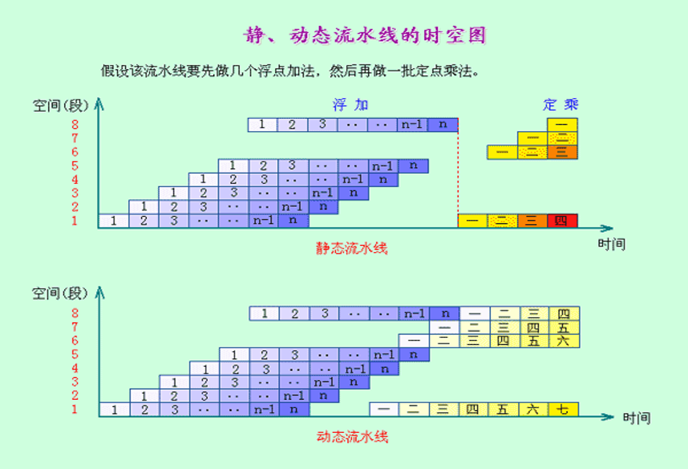

# C3 流水线技术
## 3.1 流水线的概念

- 定义：流水线是利用执行指令操作之间的**并行性**，实现多条指令重叠执行的技术。
- 流水线周期：指令沿流水线**移动**一个流水段的时间。长度取决于最慢的流水段，一般是一个时钟周期（有时是两个时钟周期）。
- 每条指令在流水线的平均执行时间在理想情况下为：
    
    非流水线机器平均指令执行时间/流水线机器段数
    
- 分类
    - 各段用时是否**均匀**
    - 按处理的数据类型：标量、向量
    - 规模：操作（算术逻辑部件）、指令（指令过程）、宏（多个处理及）
    - 功能：单功能、多功能
    - 工作方式：静态、动态
        
        
        
    - 连接方式：线性（同步、异步）、非线性
- 特点
    - 缓冲寄存器
    - 各段时间尽量相等
    - 装入时间、排空时间
    - 解决流水线瓶颈的方法：细分瓶颈段、重新设置瓶颈段
- 时空图
    
    
    
- 衡量流水线性能的指标
    - 吞吐率
    
    
    
    - 加速比
        
        假设：不使用流水线（即顺序执行）所用的时间为Ts，使用流水线后所用的时间为Tk
        
    - 效率
        
        面积比值
    
    

    

- 流水线段数
    - 要钱、装不下、有延迟

## 3.2 无流水线

- IF-ID-EXE-MEM-WB
- 硬件冗余
    - ALU可共享
    - 指令存储器和数据存储器可共享

## 3.3 经典五级流水线

- 流水线怎样减少执行时间
    - 每条指令用一个周期：降低时钟周期长度
    - 每条指令执行用多个时钟周期的机器：流水线减少CPI
- 注意事项
    - 使用寄存器来保存从存储器取出的指令——保证处在各个段的指令不会互相干扰

## 3.4 流水线冒险

### 3.4.1 停顿

- 一条指令被停顿后，**其后的所有指令被停顿**；该指令之前的指令必须继续执行。
- 气泡
- 流水线加速比
    
    
    
- 流水线CPI = 理想CPI + 平均每条指令的停顿周期数
                 = 1 +平均每条指令的停顿周期数

### 3.4.2 结构冒险

- 发生在同一个时钟周期，2条或多条指令想要使用同一个硬件资源
- 常见引起结构冒险的情况为
    - 多重访问存储器
    - 多重访问寄存器堆
        
        
        
    - 没有或没有充分流水线功能部件
    
    
    

#### 3.4.2.1 解决方法

1. 插入停顿——增加CPI，降低加速比
    
    
    
2. WB阶段先写，ID阶段后读
    
    
    
3. 多个存储器端口、分开指令存储器和数据存储器，使用指令缓冲器等(增加硬件资源)

#### 3.4.2.2 性能

- 没有结构冒险的CPI更低，速度更快
- 忽略结构冒险：**减少成本、减少部件延迟**

### 3.4.3 数据冒险

- 由于流水线上指令重叠执行，使得后面依赖前面指令结果的指令得不到准备好的数据
    
    
    

#### 3.4.3.1 纯暂停方法

- 停顿的方法：
    - 软件：编译器加入nop指令
    - 硬件（硬件互锁：InterLock）
        - 增加额外硬件**检测需要停顿的情况（字段位）**
        - 增加额外硬件**放“气泡”（暂停）到流水线（执行但无效）**

#### 3.4.3.2 数据前推的方法 （前推、直通、转发…）

- **结果已经计算好，存放在流水线寄存器中**
- 增加数据线传输此类结果，从后面的流水段连接到前面的流水段

    

- 硬件变化
    
    
    
    
    
    
    
    
    
    
    
- 不能解决的问题
    
    
    
    - 解决方法
        
        
        
        
        

### 3.4.4 控制冒险

- 在进入ID段时，转移条件和转移目标地址，不能按时提供给IF段取指令。
    - Why
        - 转移目标地址需要时间
        - 转移条件分析也需要时间
    - 影响
        - 比数据冒险大得多
- 解决方法
    - 冻结或冲刷流水线Freeze or flush the pipeline
    - 预测转移不发生Predict-not-taken (Predict-untaken)
    - 预测转移发生Predict-taken
    - 转移延迟Delayed branch
- 任何一种方法都会使硬件固定
- 后三种方法可以通过软件的方法提高性能

#### 3.4.4.1 冻结或冲刷流水线（插入Stall）

- 降低了转移不发生的性能

#### 3.4.4.2 预测转移不发生

- 硬件实现
    - 对每条转移指令都当作转移未选中处理 (or as the formal instruction)
    - 当转移未选中时，取到的指令正好是要继续执行的，**没有任何停顿。**
    - 如果转移选中，则重新取转移目标指令，**此时引起3个stall**。

#### 3.4.4.3 预测转移发生

- 硬件实现
    - 只要转移目标地址计算出来，就开始取目标指令
        - 只有在目标地址计算比转移结果更早产生才有用
        - 对于经典5段流水线，是先得到转移结果后得到转移目标地址，因此转移选中方法没有任何益处（也就是bpc的运算在exe级进行）。
    - 转移地址提前计算
        - 转移时，目标地址提前到ID段计算，**转移条件判断不变**
            
            
            
    - ID级检测
        
        
        
        
        
        - 只需要插入一个Stall
- 无论是预测不发生还是预测发生
    - 通常，选择方向是对的；偶尔，选择是错的
    - 错误的指令必须没有真正执行，尤其是**不改变机器状态**

#### 3.4.4.4 转移延迟

- 对于转移条件与地址计算在ID级的流水线
    - 好的方面：一个stall就够了
    - 坏的方面：总有一个clk要等待
- 思路：利用中间这个转移延迟槽运行有用的指令
    
    
    
    
    
    - b和c要有撤销功能

## 3.5 流水线处理机及其设计

### 3.5.1 流水线处理机的指令系统

- add、sub、and、or、beq、bne、jmp、load、store
- alu：将结果写进寄存器、将zero写入z寄存器

- 各阶段的工作
    - IF：按PC取址
    - ID：指令译码、读寄存器、偏移量的符号扩展、转移指令的计算
    - EXE：计算数据存储器的有效地址，R-R/R-I的ALU计算
    - MEM：Load/Store
    - WB：写结果到寄存器堆
- 时间计算
    
    
    
    
    

## 3.5.2 流水线处理机的数据通路

> 无相关流水线模型机多条指令执行过程
> 
- 必须使用寄存器来保存从存储器取出的指令
    - 使用触发器寄存器，不使用锁存寄存器
- 各级之间需要传输的信号（未考虑控制信号）

- 同时用到ra、rb、imm的指令：store指令，在reg的输入A2处，使用多路选择器选择A2为rd，在ALU前，选择输入端B为imm，而rb用于输入S
- alu运算类、load和store的执行过程
    - add r2 r3 r4
        
        
        
    - load r1 10（r5）
        
        
        
    - store r3 20（r1）
        
        
        

### 3.5.3 流水线模型机的控制信号

1. 运算类个存储器访问类
    
    
    
2. 转移类
    
    
    
    - BTAKEN=1,选择符号扩展偏移量disp；时钟上升沿（本周期结束将目标地址打入PC）
    
    
    
3. 最终信号产生方式图
    
    
    

## 3.6 流水线模型机的冒险处理

### 3.6.1 结构相关处理

### 3.6.2 数据相关处理

#### 3.6.2.1 纯暂停

1. 增加数据相关的硬件检测
    1. 检测**先写后读**
        
        
        
    2. 检测先写后存(store类型的指令的rd是前一条指令的rd)
    3. 检测是否WREG（store使用rd，但不写寄存器）
    4. 用操作码区分i型指令，i型指令的部分与rs2重叠。还有bne\beq\branch
        
        
        
        
        
2. 增加硬件将stall信号插入流水线
    1. 禁止新PC值打入PC（WPC）
    2. 禁止新指令打进IR（WIR）
    3. 封锁当前正在译码的指令的写控制信号（ID_WZ,ID_WMEM,ID_WREG）
        
        
        

#### 3.6.2.2 数据前推实现

> 能完全避免ALU指令相关而造成的流水线停顿
> 
1. 在ALU的两个数据输入端各加一个多路器，使R和C中的数据能被直接送到ALU的输入端
    
    
    
    1. 新增选择信号 ADEPEN\BDEPEN
        
        （检查冒险detect在EXE级）
        
        1. ADEPEN
            
            
            
            
            
            ?ADPEN2=?
            
        2. BDEPEN
            
            
            
            
            
            
            

#### 3.6.2.3 load前推实现

- 使用内部前推技术也无法消除load指令与它的下一条指令之间的第一个气泡

### 3.6.3 控制相关处理

- 转移指令需要n个周期完成的话，n-1条指令将受到影响

- branch之后的指令要做到
    - EXE结束之前清除WZ
    - MEM结束之前清除WMEM
    - WB结束之前清除WREG
- 暂停逻辑条件
    
    
    
    - 判断EXE的指令是ALU指令
        - EXE_SLD为0表明不是load指令
        - EXE_WEG为1表明不是store指令
- 延迟转移
    - 规定ALU分为两类：一类纯计算，一类写Z
    
    
    
    
    
    
    
    - 需要硬件和编译器都满足延迟转移

## 3.7 精准异常和非精准异常

- 精准异常：
    - 异常指令之前的所有指令正常完成
    - 异常指令及其后的指令没有改变机器的状态
    - 要实现精准异常，需要设置硬件实现按**指令顺序**处理异常
- 非精准异常
    - 不同指令执行需要的时钟周期数有多种时，难以实现精确异常。
    - 又如：多处都对存储器进行修改，则难以恢复到原状态
- 某些流水线处理器实现了两种工作模式：精确异常和非精确异常
    - 特殊的软件指令保证精确异常
    - 处理器若工作在精确异常模式下，运行速度更慢。
    - 一般来说，整数操作异常是精确的，而浮点异常一般不是精确的。

## 3.8 经典5段流水线扩展浮点流水线，涉及到的写冲突、相关及处理

- 延迟 ---在上一条指令生成结果之后，**下一条指令能正常使用该结果而需等待的周期数**
- 初始间隔---多条指令发射到同一个部件需要间隔的时钟周期数（避免结构冒险）
- RAW Hazard

- 涉及到的写冲突：
    - FP寄存器写端口的结构冲突
    
    
    
    - 顺序发射乱序完成产生WAW冒险
    
    
    
- 解决方法
    
    
    

