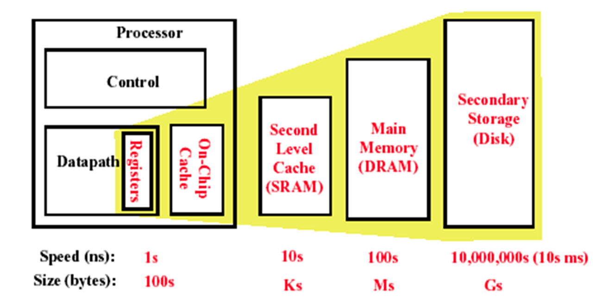

# C4存储器层次结构

1. Cache存储器的三种映像方式（全相联、直接映射、组相联），物理地址与Cache地址的映射计算，Cache的映像规则，块标识，替换算法、写策略、性能计算。
2. Cache性能优化的方法，减少缺失率4种，减少缺失代价5种，减少缺失率或缺失代价3种，减少命中时间5种。
3. 主存储器优化性能的技术：增加带宽，交叉访问存储器
4. 虚拟存储器基本概念，页式虚拟存储器，映像规则，查找方法，替换算法，写策略，快表TLB的结构与作用
5. 虚拟存储器与cache综合的地址计算

## 4.1 引言

- CPU和存储器之间存在着性能差距
- 三类计算机在存储器层次的关注点不同
    - 桌面计算机：最初为单个应用——平均延时
    - 服务器计算机：上百上千应用——存储器带宽
    - 嵌入式计算机：保护作用不重要、主存很小
- 利用局部性原理加速存储器速度
    - 时间局部性\空间局部性
- 靠近CPU的存储器越小、越快、越贵
    
    
    
    
    
- Cache按块进行管理，
- Cache设计者需要考虑：
    - 块放置（如何映射）—— 直接映射、全相联、组相联
    - 块识别（如何判断命中）—— Tag
    - 块替换（不命中如何替换）——Random、LRU、FIFO
    - 写策略（对块进行写时如何操作）——WriteBack写回和Write Through写直达

## 4.2 三种映像方式

- Cache的映像规则
    - 直接映像：块只能放在Cache中的唯一位置
    - 全相联：块能放在Cache的任一位置
    - 组相联：能放在一个组内的任意位置，n个块称为n路组相联。

- 关于块识别（是否命中）——物理地址到Cache地址的映射
    - 都有一个**有效位在Cache块处**：块是否有效
    - 物理地址
        
        
        
    - 都有一个**块内偏移在物理地址**位数=log2(#块内字节数)
    - 三种方式的物理地址**都有一个Taq在物理地址**，用来和寻找到的Cache块做对比：位数=物理地址位数-索引位数-块内偏移量
    - 直接映射和组相联使用**Index在物理地址**标识搜索的范围
        - 直接映射：指定特定的一个块搜索（是就是），位数=log2(#块数)
        
        
        
        - 组相联：指定一个组搜索（全部都不是才不是），位数=log2(#组数)
            
            
            
        - 全相联：只有一个范围，不需要。
            
            
            
- 替换算法
    - 随机替换：均匀替换、随机数产生器实现、容易替换要访问的
    - 最近最少使用LRU：需要额外的位记录历史
    - 先进先出FIFO：
- 写策略
    - 写直达：Cache和主存同时写，主存数据始终最新，Cache数据随便丢失
        - 保证数据一致性、实现简单
        - 出现**写停顿**：等待写入主存——解决：使用**写缓冲**减少停顿
    - 写回：不写主存，读缺失替换时再写，需要dirty位标识是否修改
        - 带宽小、写cache速度更快
  
    - 🤔 写缺失：
        写的块不在cache里
        对于写直达：直接写入主存，不写进cache里
        对于写回：先把块调入cache，再写
        

    

## 4.3 cache性能

- **缺失率**：访问缺失次数占访问总次数的百分比
    - 考虑所有指令中访问存储器的指令数
    - 考率所有指令中访存缺失的指令数
    - 所有指令都要访问指令存储器（在分离式cache中）
- **缺失代价**：Cache访问缺失时，访问下一级存储器所花费的时间，通常用时钟周期数表示。
- **CPU执行时间：**（ CPU 时钟周期数 + 存储器停顿周期数）×时钟周期时间
    - 存储器停顿时钟周期数 = 指令数 ×每条指令访存次数× 缺失率× 缺失代价
        
        
        
- **平均存储器访问时间**
    
    
    
- 分离cache vs 一体cache**（注意load和store增加的命中时间只影响数据访问）**
    
    
    
    
    
- 直接映像 vs 2路组相联
    
    
    
## 4.4 改善性能的方法
    

    
### 4.4.1 减少缺失率
    
- 缺失来源
    - 强制缺失（第一次一定不在cache）（冷启动缺失或首次访问缺失）
    - 容量缺失（满了替换）
    - 冲突缺失（组相联或直接映像，太多快映射到一个组里）（碰撞缺失或干涉缺失）
    - 一致性缺失（多个cache的一致性）
- 强制缺失与容量无关、容量缺失随容量增大而减少、相联度越高冲突缺失缺少
- **2:1的Cache经验规则，即大小为N 的直接映象Cache的缺失率约等于大小为N/2的两路组相联Cache的缺失率。**
- **8-路组相联cache与相同容量全相联cache有效减少冲突缺失的效果几乎相当。**
- 减少缺失率的方法
    - 增大cache容量——容量缺失down、冲突缺失down（还要取决于下一级存储器的延迟和带宽）
    - 提高关联度——冲突缺失down（经验法则、时钟周期up！）
    - 增大块大小——强制缺失率down（但会增加缺失代价，同时增加冲突缺失）
    - 编译器优化——
        - 指令的跳转预测；
        - 数据的合并数组（struct一下）、循环交换（行遍历）、循环融合（两个循环用到相同的数据）、分块（）

### 4.4.2 减少Cache的缺失代价（5个）

- 多级Cache
    - 多级Cache的作用
        
        
        
        - 减少二级cache的缺失率→减少一级cache的缺失代价
    - 性能计算
        
        
        
    - **局部缺失率**——这一级 cache 的缺失次数除以访问这级cache的总次数（缺失率L2），级数越高局部缺失率越大。
    - **全局缺失率**——这级 cache的缺失次数除以CPU产生的访存总次数，给出了cpu到存储器访问不同路径所占的比例。
        
        
        
        
        
    
- 关键字优先、提前重启动
    
    
   
    
- 读缺失的优先级高于写缺失（RAW，read-after-write冒险）
    - 如果系统有写缓冲，写操作能够延迟到读后。
    - **但是，系统必须小心检查写缓冲中是否有读缺失要读的值。**
    - 对于写直达
        - 等写缓冲空，可能增加读缺失代价
        - 读之前检查写缓冲，没有冲突则读优先
    - 对于写回
        - 读缺失替换脏块
        - 如果有写缓冲：复制脏块到写缓冲，然后先读，再写。
        有读缺失时，也要检查写缓冲，看地址是否有冲突，没有则可以读缺失优先。
- 合并写缓冲
    - 用写多个字代替写一个字
    - 合并写优化技术有时可以减少写缓冲满时导致的停顿。
    
    
    
    
    
- 牺牲缓存
    - 牺牲缓存是一个小的全相联 cache，它存放几个最近被替换出的块 。 该技术常见并非必须。
    - 在发生缺失要访问下一级存储器以前，先检查牺牲cache：
        - 看是否有缺失的数据
        - 如果有，交换牺牲块与 cache 块。

### 4.4.3 利用并行减少Cache代价或缺失率（3种）

- 非阻塞cache减少cache缺失停顿
    - 非阻塞cache：当等待取数据返回的同时(处理缺失)，Cache并不停止，而是可以继续提供指令和数据的命中（缺失下命中）。
- 指令和数据的硬件预取减少缺失
    - 本质
        
        
        
    - 预取方式
        - 捆绑预取——请求预取的值直接装入寄存器
        - 非捆绑预取——将数据预取到 cache，不放入寄存器。
- 编译器控制的预取

### 4.4.4 减少Cache命中时间

- 小和简单的Caches
    - 直接映像无论是读还是写都快于组相联cache。
    - 命中的cache与CPU在同一芯片上，对于加快访问时间是非常重要的。
- 在cache索引时避免地址转换
    - 传统物理地址Cache存在的问题：地址转换CPU使用虚拟地址VA，Cache使用物理地址PA。
        
        
        
    - why：页表在主存中，是一个大的数据结构，从主存取数据、存结果、取指令，**需要2次访问主存！**
    - TLB快表
        
        
        
    - 避免VA PA地址转换的方法
- 流水线化地址访问
    - 写命中比读命中花费更长时间，因为在检查标识后才能写入数据。
    - 将写操作分为两步：第1步标识检查；第2步写数据。
    - 本次写的第2步与下次标识比较的第1步同时进行。
- 路预测

- 踪迹 caches
    - 块中是动态指令序列（包括发生分支），而不是限制指令在一个静态cache块中（空间局部性）。
    - Cache块中包含了由CPU确定的要执行指令的动态踪迹，而不是仅由存储器确定的静态指令序列。
        - 转移预测操作需要加入到cache，预测的地址必须单独验证以证明是一次有效的取操作。
        - 该方法在Pentium 4上使用，踪迹cache中存放的是译码后的微指令。

### 4.4.5 Summary

## 4.5 主存储器优化性能的技术

- 主存的性能
    - 带宽
    - 延迟
- 基本主存组织的性能
    - 每次缺失的缺失代价都为4+56+4=64Clk？
    
    
    

### 4.5.1 增加主存带宽

- 双倍或四倍cache与主存之间的带宽
- 主存带宽也将增加双倍或四倍

### 4.5.2 简单交叉存储器

- 利用了存储系统中具有多个DRAM潜在的并行性。

## 4.6 虚拟存储器

> 虚拟存储器基本概念，页式虚拟存储器，映像规则，查找方法，替换算法，写策略，快表TLB的结构与作用

- 什么是虚拟存储器
    - 允许一个程序不放在连续的存储位置执行，不必都加载到主存中
    - 但是程序看到的是连续的存储地址，**存储空间比物理存储器实际空间大**。
- 用处
    - 主存不必太大
    - 不必管理主存
    - 多道处理
- 相关术语
    - 块、页、段
    - 页缺失、地址缺失
    - 地址转换
- 控制的存储层次：DRAM-磁盘
- 存储层次的四个问题
    - 存在哪里：高缺失代价→全相联策略
    - 如何查找一个块：
        
        
        
        
        
    - 替换哪个块
        - **LRU策略**
        - 标志位
    - 写策略
        - 访问磁盘太久→**写回策略**→设置**脏位**
- 快表
    - why：页表太大+存在主存里→页表分页→查页表的页表，查页表，取数据多次访存→加cache（TLB（ Translation Lookaside Buffer ）变换旁路缓冲器。）（**全相联**）
    
    
    

## 4.7 虚拟存储器和Cache的综合

- 虚拟地址：查物理页号的部分+页内偏移
- 快表：查物理页号的部分用于查表，**全相联**一次遍历，得到物理页号
- 物理页号+页内偏移→物理地址
- 物理地址用于cache的命中（注意cache的地址是index+tag+块内偏移）
    
    
    
