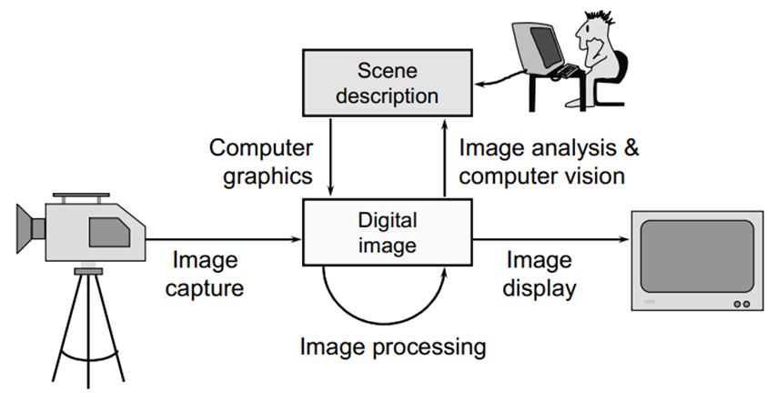

# Chapter-1-Base
## Section1

### 图形学定义

通过计算机生成、控制、存储物体及其图像，即建模和渲染

### 图形学主要内容

建模——三维物体的计算机表示：形状表述和定义

渲染——三维物体的二维表示：通过矩阵变换生成几何物体的二维图像

动画——快速显示的图像序列或动作序列

### 图形和图像

图形——场景的几何模型和景物的物理属性

- 点线面体......
- 灰度、色彩、线型、线宽......

图像

- 广义：所有具有视觉效果的画面
- 数学：f(x,y)的值——灰度或RGB（强度）
- 数字图像：x,y,f(x,y)都是有限的离散量
- 像素：组成图像、像素值

### History

1963、首次提出、阴极射线管显示器和光笔、交互生成简单图形（Sutherland......）

## Section 2

### 图形系统

### 视频显示设备

- 刷新式CRT
    - 聚焦、加速、偏转→荧光屏
    - 余晖（发光到10％）——长短余晖
    - 光点——能够显示的最小发光点，硬件最小图像点，物理直径——亮度60%
    - 屏幕分辨率——无重叠显示的最大光点数（水平*垂直，光点物理直径，DPI）
    - 显示分辨率——用于显示图像的最大像素数
- 光栅扫描&随机扫描
    - 光栅扫描：自顶向下
    - 随机扫描:一次画出一条线
        
        
        
        
        
- 光栅扫描系统
    - 帧缓存容量计算：
        - 色深——像素点信息的长度
            - 黑白——色深为1bit
            - 彩色——色深为（16色——4bits，256色——8bits）
- 彩色CRT
    - 电子穿透法——随机扫描
    - 荫照法——光栅扫描
- 平板显示器
    - 发射型和非发射型...
    - 等离子板
        - 两块带有水平和垂直导电带的玻璃板，之间充斥这氖气
        - 成对的导电带之间点火，分解为离子和电子构成的发光等离子
        - 通过**阻塞**或**传递**来自周围的或内部光源的偏振光形成图案

### 软件

- 分类
    - 通用编程软件包
    - 专用应用软件包
- 坐标表示
    - 建模变换、世界坐标、观察变换与投影变换、规范化设备坐标、设备变换

## Section 3

- 图元绘制
    - 点绘制、像素寻址
    - 线绘制：
        - DDA：一个坐标上单位间隔取样、另一个坐标上以m或1/m变换
        
        
        
        评价：没用乘法，比y=m*x+b快、取整和浮点运算耗时、有误差
        
        - Bresenham（0<m<1）
        
        
        
        看看推导
        
        - 中点画线算法
        
        
        
    - 圆生成
        - 利用对称性
        
        
        
        
        

### 凹多边形

- 叉乘法

- 延长线法

### 非标准多边形内部区域的鉴别——作不经过顶点的射线

- 奇偶规则——射线外穿，奇数内部，偶数外部
- 非零环绕数规则——左→右-1     右→左+1    内部区域非0

### 字模构成

- 点阵式——逐位映射得到字符的字模编码Bitmap
    - 易于定义显示，空间需求大，难以变换
- 矢量式——字符笔画分解成线段，端点坐标为字符字模的编码Stroke
    - 空间需求小，时间开销大，无级缩放

## Section 4

### 图元属性

- 直接存储：

- 颜色表存储：帧缓存存储颜色查找表索引值
- 

### 扫描线填充算法

- 自底向上扫描
- 求交——排序——配对——填色

### 边界填充算法

- 填充区域边界以一种颜色指定，从内到外填色
- 适用于单色边界
- 4连通/8连通
- 4连通可能不完整/8连通越界

### 反走样

> 图形数字化过程中，由于低频采样而造成的图形畸变→走样
> 

> 通过修改沿图元边界像素的亮度来平滑边界/减少锯齿现象

- 硬件要求
- 抗锯齿方案
    - 过取样技术——高分辨率取样低分辨率显示
    - 区域取样——通过计算待显示的对象在每个像素上的覆盖区域从而确定像素亮度
        - 像素覆盖区域通过确定对象边界与单个像素边界的相交处而得到
    - 像素移相——通过移动像素区域的显示位置实现反走样
        - 通过与对象几何形状相关的电子束的微定位而作用
    - 子像素加权方案
        - 赋给接近于像素区域中心得子像素更大的权值
        - 离散的加权方案