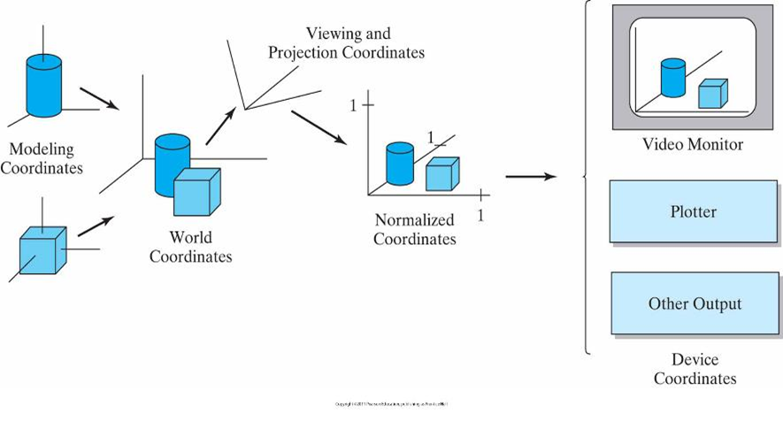

# Chapter-2-Transfomation

## 2D Geometric transformation

### Basic Transformations

- 改变对象方向（orientation）、尺寸、形状的几何变换
- 建模坐标系→世界坐标系→观察坐标系

三维观察管道

- Translation:A rigid-body transformation without deformation
- Rotation
- Scaling

#### 矩阵表示

- 二阶形式
    
    
    
    M2——包含平移项的矩阵
    
    
    
    平移转换      P‘=T（tx,ty）*P
    
    
    
    旋转转换    P’=R（ζ）*P
    
    
    
    缩放变换        P‘=S（Sx，Sy）*P
    

- 齐次坐标（用n+1维的向量表示n维空间中的点）
    
    > 二维空间中点的坐标(x , y)的齐次坐标表示为(h*x ，h*y ，h)(h≠0的任意实数)。
    只要给定一个点的齐次坐标表示(xh ，yh，h)，就能得到唯一的笛卡儿坐标(x , y)
    x= xh/h   ， y=yh/h
    **齐次坐标唯一表示笛卡尔坐标
    当h=1时，为规范化齐次坐标
    引入目的：将平移、缩放、旋转改为统一形式/**
    > 

---

### Composing Transformation

#### 连续xxx

- 连续平移：具有可加性

- 连续旋转：具有可加性

- 连续缩放：相乘

- Decomposing:旋转后平移不是复合变换

#### 通用基准点变换

- 平移移到原点
- 作变换
- 反平移到原位置

#### 通用方向变换

- 旋转对象与坐标轴重合
- 针对坐标轴作变换
- 反向旋转到原位置

#### 通用复合变换矩阵

**General Composite Transformations:**
1）合并所有变换序列，形成变换矩阵，最后计算变换坐标.
采用x’=x*rsxx+y*rsxy+trsx
y’=x*rsyx+y*rsyy+trsy
计算最后坐标
2）用近似计算和循环计算减少计算量
例如，旋转角度小时，其余旋量近似为1，正旋量近似角度弧度值
3）逆矩阵计算

### 其他变换

#### Reflection反射

#### Shearing错切

#### 坐标系间的变换

坐标系变换示例

#### 光栅变换

- 通过将储存的像素值的矩阵数组在帧缓冲器内从一个位置变到另外一个位置
- 将一块像素从一个位置移动到另外一个位置：像素的块移动（位块移动）

## 3D Translation

### Basic Translation

平移

缩放

旋转

绕x轴旋转，y，z在2，2/3，3

### Composite Translation

- 旋转轴平行于坐标轴
    - 平移使得旋转轴和坐标轴重合
    - 操作然后平移回去
- 旋转轴不平行于任一坐标轴
    - 平移使其过原点
    - 旋转使其与坐标轴重合
    - 操作后恢复原状态
    
    
    
    通用三维旋转
    
    
    
    旋转操作：先转到面，后转到轴
    
    
    
    
    

### Reflection&Shearing

XOY平面反射

YOZ平面反射

z轴错切