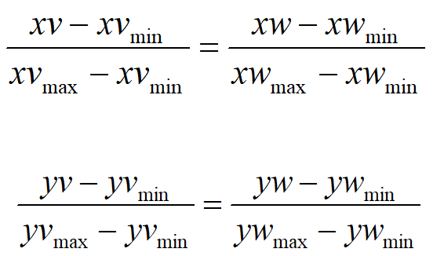

# Chapter-3-Viewing

## 二维观察

### 2D观察流水线

- 常规图形系统中，世界坐标系中指定的用于显示的坐标区域→clipping window（裁剪窗口）/window（窗口）
- 显示设备上用于窗口映射的坐标区域→视区/视口
- 窗口→视口：观察变换

#### WC-TO-VC

- 平移使观察坐标系原点和世界坐标系原点重合
- 旋转使得两个坐标系的坐标轴重合

#### 窗口-TO-视口

- 平移使VC原点和WC原点重合
- 旋转使坐标系的坐标轴重合
    
    
    
    
    

## Clipping

> 识别图形在指定区域内或外的过程
> 

- 点裁剪（略）
- 直线裁剪
- 多边形填充区域裁剪
- 曲线裁剪
- 文字裁剪

### 直线裁剪

> 还有一种非矩形裁剪算法（自学）
LB vs CS:LB效率高于CS，减少了交点计算次数，参数u1，u2的更新需要四次除法，交点坐标计算至多4次乘法。两者都比较容易扩展为三维裁剪算法
> 

#### Cohen-Sutherland（CS）算法

> 测试直线端点和边界的位置判断是否需要求交点
> 

- 计算直线端点编码
    - c1和c2均为0000，保留直线
    - c1&c2不为0，在同一边界外，删除直线
    - c1&c2为0，进一步求交点
- 求交点的次数决定于算法的速度

#### Liang梁友栋-Brasky算法(LB)

> 基于直线段参数方程分析的快速直线裁剪算法，相对于CS减少了计算次数
> 

此处对u1u2都进行运算，求出两个端点值

#### Nicholl-Lee-Nicholl算法（NLN）

> 通过在裁剪窗口周围创立多个区域，并在求交运算之前进行更多的区域测试，从而避免对直线段的多次裁剪，仅仅适用于2D裁剪
> 

P1位于内部，设定四个裁剪区域，P2位于窗口内部，P1P2保留，位于窗口外部则求交点并保留P1P

P1位于窗口左侧：P2在L区域求和左边界保留P1P位于LT，计算直线与窗口左边界/上边界的交点并保留该线段部分....

### 多边形区域裁剪

#### Sutherland-Hodgman算法

> 以多边形顶点为初始集合，首先左边界裁剪，产生新的顶点序列，然后依次右/下/上，最终输出顶点序列（左→右→下→上）
> 

case1：输出i和p

case2：输出s和p

case3：输出i和s

case4：无输出

- 不可以直接用CS裁剪：丢失边界部分
- 用于凸多边形裁剪：处理凹多边形时产生多余线段
- 算法改进：窗口的四个边界都确定一个点时才加入到输出顶点表中

#### Weiler-Atherton算法

> 通过修改多边形顶点处理顺序，从而正确显示凹多边形：
对由外朝内：沿多边形边界方向
对由内朝外：沿窗口边界方向直到到达另一个与多边形的交点并且该交点是已经处理的顶点
回到交点并继续按原顺序处理多边形的边
> 

p270/p279

### 文本裁剪

#### 字符分类

- 点阵字符
- 矢量字符

#### 全无或者全有字符串裁剪

#### 全有或全无字符裁剪

#### 单字符裁剪

---

---

## 三维观察

### 概述

Depth Cuing 近亮远暗

### 3D观察流水线

### 3D观察坐标系

#### 观察坐标系的建立

- 观察参考点——观察坐标原点（N）
- 以上述向量为任一坐标轴（z轴）
- 指定观察向上向量（不和N平行）
- 用叉乘确定其余坐标轴

作用：用于指定观察者的观察位置及投影平面的参考系

#### 世界坐标系→观察坐标系

### 3D Projection Transformation

平行投影和透视投影

平行投影的正投影和斜投影

#### 正投影

正三面投影：三视图，投影平面法向量和三坐标轴之一平行

轴测正投影：显示物体的多个平面

等轴测投影：投影平面与每个坐标轴的交点距坐标原点的距离相等

#### 斜投影

- 斜等测投影：α=45°——垂直于投影平面的线条投影后长度不变
- 斜二测投影：tanα=2——垂直于投影平面的线条投影后得到一半的长度

#### 投影变换矩阵（斜投影?）

#### 透视投影

- 投影中心COP——也叫投影参考点PRP
- 投影平面——也叫观察平面VP
- 投影线——也叫视线（从投影中心发出的，是不平行的）

- 透视投影的类型：
    - 灭点：3D物体的一组平行线投影后收敛于一点
    - 主灭点：3D物体平行于坐标轴的平行线收敛于产生的灭点
    - 一点/二点/三点透视

### 3D 观察体（3D View Volume）

- 观察体：3D场景选取窗口/3D裁剪窗口
- 作用:对三维物体进行裁剪，只有在观察体内的物体才会被投影到投影平面上显示出来
- 投影窗口：投影平面上的矩阵选景窗口

无穷平行管道

棱锥

矩形平行六面体

棱台

斜的

### 3D Clipping

- 裁剪窗口是六面体

#### 平面方程裁剪

#### 编码裁剪（CS算法）

#### 参数方程裁剪

---

## 可见面的判断

> 判别的目标：从一个选定的观察位置识别场景的哪些部分时可见的
> 

> 判别的动机：①正确性 ②处理速度
> 

> 可见面判断算法，按实现空间分类
①物空间算法（Object-space methods）
②像空间算法（Image-space methods）
> 
- 物空间算法
    - 在场景坐标系中实现
    - 算法精度较高
    - 将各对象和对象的某些部分彼此比较，通过有关几何运算，确定哪些可见的。
- 像空间算法
    - 屏幕坐标系中实现
    - 对投影平面或者屏幕上的每一个像素位置逐点检测其可见性
    - 算法比较粗糙
    - 计算效率比较高
- 可利用排序和连贯性来提高算法性能
    - 排序主要用于深度比较
    - 连贯性利用图形的规则性

### 物空间算法

#### back-face detection后向面判别

V·N>0即0<ζ<90  则为后向面

- 对于凸多面体：可判断所有后向面
- 对于凹多面体:还需进行其他判断操作
- 高效、可用于预处理

#### painters algorithm画家算法（仅作了解）

### 像空间算法

#### z-buffer 深度缓冲器算法

寻找最小的z(x,y)

z-buffer直观图

利用连贯性

- Evaluation
    - 易于实现
    - 空间需求大
    - 每个像素点只能找到一个可见面，只能处理非透明表面

#### A-Buffer

> Z-Buffer的改进算法，满足透明表面处理的需求
A的含义：
      antialiased（反走样）
      area-average（区域平均）
      accumulation-buffer（累积缓冲器）
> 

- 深度域：存储一个或正或负的实数，正表明不透明，负表明透明
- 强度域：包括RGB强度分量、表面绘制参数、深度、覆盖面、指向下一表面的指针
- 评价：
    - 深度缓冲区算法的改进
    - 可处理透明表面
    - 可对物体的边界进行反走样处理

#### Scan-Line Method(不作要求)

