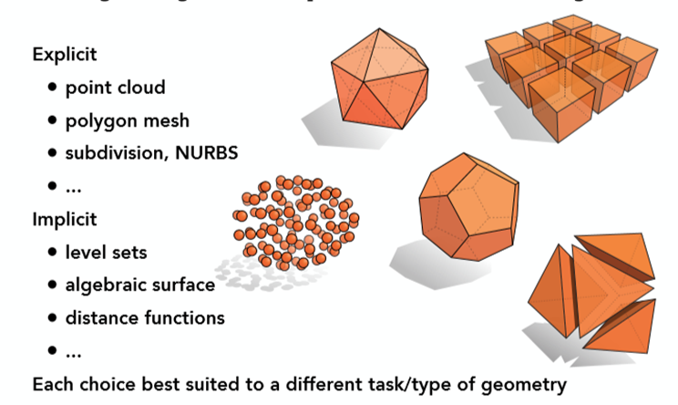

# Chapter-4-Modeling

## Many Ways

- 三维对象的表示方法
    - 边界表示Boundary representation
    - 空间分区Space-partitioning representation
- 表面多边形以线性方程描述物体的表面绘制和显示使得其简化。

使用一组曲面/平面将物体分成内外

将包含物体的空间区域划分成一组较小的、非重叠的、邻接的实体

Open-GL 相关函数

## 建模方式

### 多边形表

- 几何表：顶点坐标和表示空间方向的参数
- 属性表：物体透明度和表面反射的参数和纹理特征
- OBJ——3D模型文件

### Polygon Surfaces 多边形网格

### Subdivision 细分方法

不同的细分规则，生成的细分曲面外形有区别
①Loop细分 ②Catmull-Clark细分 ③Doo-Sabin细分

## 曲线和曲面

- 给定数学函数/给定控制点
- 给定指定曲线方程投影到显示平面上，且**沿着投影函数**路径绘制像素位置
- 由函数式生成的显示曲面的例子有二次曲面和超二次曲面

## 样条表示

### Def

### 曲线

- 产生：给定控制点，拟合指定的曲线函数
- 类型：
    - 插值样条曲线：通过每个控制点
    - 逼近样条曲线：不一定通过每一个控制点

### 凸壳

- 定义：包含一组控制点的凸多边形边界
- 作用：提供了曲线或曲面与包围控制点的区域之间的偏差的测量，以凸壳为界的样条保证了多项式沿控制点的平滑进行。
    
    
    

### 参数连续性条件

### 几何连续性条件

### 样条曲线相关

## Bézier曲线和曲面

### Bézier曲线构造公式：

假定给出n+1控制点: Pk=(xk,yk,zk), k取值范围为0到n，这些坐标值用于合成向量 P(u),

### **Blending Function 合成函数**

Implementation(第四版14章)

---

### Bézier曲线特征

- 第一个点和最后一个点重合能生成闭合的曲线
- 多个控制点位于同一位置会加更多的权值（更往该控制点偏）

---

### Bézier曲面

> 使用两组正交的Bézier曲线来设计（m+1）*（n+1）个控制点
> 

## 实体构造技术

> 用简单的物体来构造复杂的物体
> 

### 扫描表示

通过平移/旋转及其他对称变换来构造三维对象

平移扫描：如图二维图像A沿z轴平移

旋转扫描：二维图像A绕着z轴旋转

### 结构实体几何法

通过对两个指定三位对象进行并交差等操作

## 八叉树&四叉树

### 四叉树

> 对二维区域递归地等分为四个象限，同质则不再分解。
> 

### 八叉树

> 利用实体的空间相关性，记录三位对象的内部信息，用于空间分区的表示。
八叉树编码过程是四叉树二维空间编码方法的扩展。
> 
- 减少三维物体的存储需求
- 提供了存储有关物体内部信息的方便表示

## 分形Fractal

> **欧氏几何法**：对象形状由方程来描述，具有平滑的表面和规则的形状。
**分形几何法**：使用过程对对象进行建模。从整体上处处不规则，在不同尺度上规则上又相同。
**区别**：欧氏——等式
           分形——步骤
> 

分形基本特征

1967年，Mandelbrot在美国权威的《科学》杂志上发表了题为《英国的海岸线有多长？统计自相似和分数维度》（How Long Is the Coast of Britain? Statistical Self-Similarity and Fractional Dimension）的著名论文。海岸线作为曲线，其特征是极不规则、极不光滑的，呈现极其蜿蜒复杂的变化。

### 分形生成过程

### 分形分类

分类

- Self-similar Fractal：部分是整体的收缩形式
    - 确定自相似&统计自相似
    - 用于画树.....
- Self-affine Fractal：自仿射分形的组成部分由不同坐标方向上的不同缩放参数sx、sy、sz形成
    - 确定自仿射&统计自仿射
    - 用于模拟岩层/水/云....
- Invariant Fractal Sets:由非线性变化形成
    - 自平方分形&自逆分形

Mandelbort set// zk-z(k-1)²+z0

Julia set//f(z)=入z(1-z)

### 分形的维数

> 描述分形对象的变化量，是对象粗糙性或细碎性的度量。用D描述
> 

ex：

确定性自相似分形维数计算

### 粒子系统Partial

